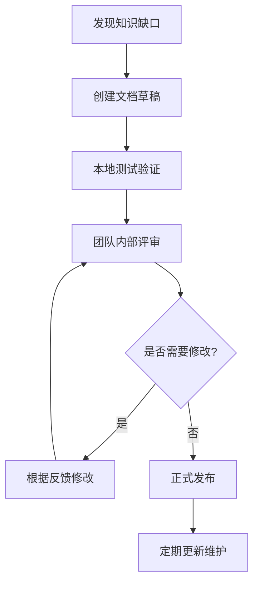
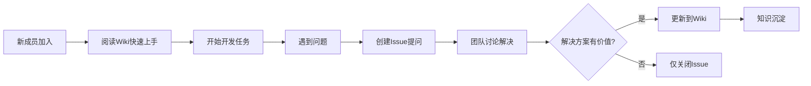
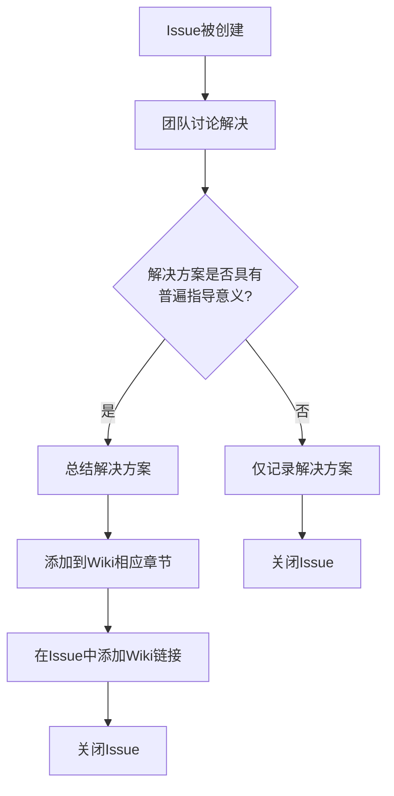

# readme-team
团队协作指南
知识共享: 项目Wiki，是怎么做的？
# 项目Wiki的完整创建和使用指南

对于STM32嵌入式团队来说，一个好的项目Wiki能极大提升协作效率。我来详细介绍几种实用的方案：

## 1. 推荐方案对比

|         方案           | 适合场景          | 费用      | 上手难度 | 推荐度    |
|------------------------|-------------------|-----------|-----------|-----------|
| **GitHub Wiki**        | 开源项目/技术团队 | 免费       | ⭐⭐    | ★★★★★|
| **Notion**             | 创业团队/学生项目 | 免费版够用 | ⭐       | ★★★★★|
| **语雀**               | 国内团队/中文友好 | 免费版够用 | ⭐       | ★★★★★|
| **GitBook**            | 专业文档/API文档  | 免费版有限 | ⭐⭐    | ★★★★☆|
| **VS Code + Markdown** | 极简/纯开发者     | 免费       | ⭐⭐    | ★★★☆☆|

## 2. 最佳方案：GitHub Wiki（技术团队首选）

### 2.1 创建GitHub Wiki
```bash
# 前提：你的项目已经在GitHub上

# 创建步骤：
1. 访问你的GitHub仓库页面
2. 点击顶部"Wiki"标签
3. 点击"Create the first page"
4. 开始编写文档

# 或者通过Git操作：
git clone https://github.com/你的用户名/你的项目.wiki.git
cd 你的项目.wiki
# 添加Markdown文件
git add .
git commit -m "添加文档"
git push
```

### 2.2 STM32项目Wiki结构示例
```
项目主页
├── 📖 项目概述
├── 🔧 快速开始
│   ├── 开发环境搭建
│   ├── 硬件连接指南
│   └── 第一个程序
├── 📐 硬件设计
│   ├── 原理图说明
│   ├── PCB布局建议
│   └── BOM清单
├── 💻 软件架构
│   ├── 目录结构说明
│   ├── 模块设计文档
│   └── API参考
├── 🐛 常见问题
│   ├── 编译问题解决
│   ├── 硬件调试技巧
│   └── 性能优化建议
└── 🔄 更新日志
```

### 2.3 具体页面示例

**`硬件连接指南.md`**：
```markdown
# 硬件连接指南

## 开发板：STM32F103ZET6（战舰板）

### 核心引脚定义
| 功能 | 引脚                     | 说明        |
|------|--------------------------|-------------|
| 电源 | 3.3V, GND                | 开发板供电  |
| 调试 | PA13(SWDIO), PA14(SWCLK) | ST-Link连接 |
| LED1 | PB5                      | 红色用户LED |
| LED2 | PB1                      | 绿色用户LED |
| LED3 | PB0                      | 蓝色用户LED |
| 按键 | PA0                      | 用户按键    |
| UART1| PA9(TX), PA10(RX)        | 调试串口    |

### 外设连接示例
```c
// OLED显示屏 (I2C)
SDA - PB7
SCL - PB6

// 温湿度传感器 (DHT11)
DATA - PA1

// 超声波模块 (HC-SR04)
TRIG - PA2
ECHO - PA3
```

### 注意事项
1. 调试时务必连接GND
2. 3.3V设备最大电流不超过500mA
3. 5V设备需要电平转换
```

**`开发环境搭建.md`**：
```markdown
# 开发环境搭建指南

## 1. 软件安装

### 必需软件
- [VS Code](https://code.visualstudio.com/)
- [PlatformIO扩展](https://platformio.org/)
- [Git](https://git-scm.com/)

### 可选软件
- [STM32CubeMX](https://www.st.com/zh/development-tools/stm32cubemx.html)
- [串口调试助手](https://www.sec.net.cn/download)

## 2. 环境配置

### PlatformIO配置
```ini
; platformio.ini
[env:genericSTM32F103ZE]
platform = ststm32
board = genericSTM32F103ZE
framework = arduino
upload_protocol = stlink
monitor_speed = 115200
```

### VS Code配置
```json
{
    "files.associations": {
        "*.h": "c",
        "*.c": "c",
        "platformio.ini": "toml"
    }
}
```

## 3. 验证安装
```bash
# 检查安装
pio --version
git --version
```
```

## 3. 国内友好方案：语雀（阿里巴巴出品）

### 3.1 创建语雀知识库
```bash
# 访问：https://www.yuque.com
# 注册登录（支持GitHub/钉钉/微信登录）

# 创建步骤：
1. 点击右上角"+" → "知识库"
2. 选择"技术文档"模板
3. 设置：
   - 名称：STM32智能家居项目
   - 描述：基于STM32F103的智能家居系统
   - 权限：团队成员可编辑
4. 开始编写
```

### 3.2 语雀的优势
```yaml
优点:
  - 中文界面友好
  - Markdown+富文本混合编辑
  - 支持团队协作和权限管理
  - 支持API导入导出
  - 移动端体验优秀
  
免费版限制:
  - 成员数: 最多5人协作
  - 容量: 足够文档使用
  - API调用: 有限制但够用
```

### 3.3 语雀文档模板
```markdown
---
title: STM32外设驱动开发规范
description: 本团队STM32外设驱动的编写规范
tags: [STM32, 驱动, 规范]
---

## 驱动文件结构
每个外设驱动应包含以下文件：
```
driver_xxx/
├── driver_xxx.c      # 驱动实现
├── driver_xxx.h      # 驱动头文件
├── driver_xxx_conf.h # 驱动配置
└── README.md         # 使用说明
```

## 函数命名规范
- 初始化函数：`xxx_init()`
- 读取函数：`xxx_read_xxx()`
- 写入函数：`xxx_write_xxx()`
- 回调函数：`xxx_callback()`

## 代码示例
```c
// 正确的写法
void led_init(void) {
    // 初始化代码
}

// 错误的写法
void InitLED() {  // 不符合命名规范
    // ...
}
```

## 版本记录
| 版本 | 日期 | 作者 | 说明 |
|------|------|------|------|
| v1.0 | 2024-01-15 | 张三 | 初版创建 |
| v1.1 | 2024-01-20 | 李四 | 添加GPIO规范 |
```
```

## 4. 国际流行方案：Notion

### 4.1 创建Notion团队空间
```bash
# 访问：https://www.notion.so
# 注册（支持Google/Apple账号）

# 创建团队空间：
1. 点击左侧"Settings & Members"
2. 选择"Upgrade" → "Team"（免费版够用）
3. 邀请成员加入
4. 创建"STM32 Project"页面
```

### 4.2 Notion数据库示例
创建STM32问题追踪数据库：

```markdown
## 🐛 问题追踪

使用数据库表格管理所有问题：

| 状态 | 问题标题 | 优先级 | 负责人 | 创建时间 | 标签 |
|------|----------|--------|--------|----------|------|
| 🔄 进行中 | ADC采样值跳变 | 高 | 张三 | 2024-01-15 | 硬件 |
| ✅ 已解决 | UART数据丢失 | 中 | 李四 | 2024-01-10 | 软件 |
| ⏳ 待处理 | PWM频率不准 | 高 | 王五 | 2024-01-12 | 驱动 |

## 📋 任务清单
- [x] 完成GPIO驱动
- [ ] 编写UART驱动
- [ ] 测试ADC性能
- [ ] 优化功耗

## 💡 最佳实践
使用代码块记录解决方案：
```c
// ADC校准步骤
HAL_ADCEx_Calibration_Start(&hadc1);
while (HAL_ADCEx_Calibration_GetValue(&hadc1) != HAL_OK);
```
```

### 4.3 Notion嵌入式模板
你可以在Notion模板库中搜索"Embedded Development"或"Hardware Project"模板，快速开始。

## 5. 开发者极简方案：VS Code + Markdown

### 5.1 创建文档项目结构
```bash
# 在代码仓库中创建docs目录
mkdir -p docs
cd docs

# 创建文档结构
docs/
├── README.md          # 项目总览
├── hardware/          # 硬件文档
│   ├── pinout.md
│   ├── schematic.md
│   └── bom.md
├── software/          # 软件文档
│   ├── getting_started.md
│   ├── architecture.md
│   └── api/
│       ├── gpio.md
│       ├── uart.md
│       └── adc.md
├── guides/            # 指导文档
│   ├── debugging.md
│   ├── optimization.md
│   └── testing.md
└── resources/         # 资源文件
    ├── images/
    └── datasheets/
```

### 5.2 VS Code Markdown增强配置
```json
// settings.json
{
    // Markdown预览增强
    "markdown.preview.breaks": true,
    "markdown.preview.doubleClickToSwitchToEditor": true,
    "markdown.preview.fontSize": 14,
    
    // Markdown编辑辅助
    "markdown.extension.toc.levels": "2..6",
    "markdown.extension.preview.autoShowPreviewToSide": true,
    "markdown.extension.list.indentationSize": "adaptive",
    
    // 安装推荐的Markdown扩展
    // - yzhang.markdown-all-in-one
    // - bierner.markdown-checkbox
    // - bierner.markdown-emoji
    // - davidanson.vscode-markdownlint
}
```

### 5.3 使用Git管理文档
```bash
# 文档编写工作流
1. 创建新文档分支
git checkout -b docs/add-adc-guide

2. 编写文档
cd docs/guides
vim adc_guide.md

3. 提交更改
git add docs/guides/adc_guide.md
git commit -m "docs: 添加ADC使用指南"

4. 推送到GitHub
git push origin docs/add-adc-guide

5. 创建Pull Request合并
# 团队成员可在PR中评审文档
```

## 6. STM32专用Wiki内容模板

### 6.1 API文档模板
```markdown
# GPIO驱动API文档

## 概述
GPIO驱动模块提供了STM32 GPIO的抽象接口。

## 头文件
```c
#include "drivers/gpio.h"
```

## 数据结构
### gpio_config_t
```c
typedef struct {
    gpio_port_t port;      // GPIO端口
    gpio_pin_t pin;        // 引脚编号
    gpio_mode_t mode;      // 工作模式
    gpio_pull_t pull;      // 上拉下拉
    gpio_speed_t speed;    // 输出速度
} gpio_config_t;
```

## 函数列表
### gpio_init()
初始化GPIO引脚。

**参数：**
- `config`: GPIO配置结构体指针

**返回值：**
- `HAL_OK`: 成功
- `HAL_ERROR`: 失败

**示例：**
```c
gpio_config_t led_cfg = {
    .port = GPIO_PORT_B,
    .pin = GPIO_PIN_5,
    .mode = GPIO_MODE_OUTPUT_PP,
    .pull = GPIO_NOPULL,
    .speed = GPIO_SPEED_FREQ_MEDIUM
};

if (gpio_init(&led_cfg) != HAL_OK) {
    // 错误处理
}
```

## 版本历史
| 版本  | 日期       | 作者 | 变更说明    |
|-------|------------|------|--------------|
| 1.0.0 | 2024-01-10 | 张三 | 初版创建     |
| 1.1.0 | 2024-01-15 | 李四 | 添加中断支持 |
```

### 6.2 调试指南模板
```markdown
# STM32调试指南

## 常见编译错误

### 错误1：undefined reference to `HAL_Init'
**原因：** 未链接HAL库
**解决：** 在platformio.ini中添加：
```ini
lib_deps = 
    stm32duino/STM32duino HAL@^2.2.0
```

### 错误2：Program size exceeds available memory
**原因：** 代码太大
**解决：**
1. 启用编译器优化：
```ini
build_flags = -Os
```
2. 移除未使用的库

## 硬件调试技巧

### LED测试
```c
// 快速测试所有GPIO
for(int i=0; i<16; i++) {
    HAL_GPIO_WritePin(GPIOA, 1<<i, GPIO_PIN_SET);
    HAL_Delay(100);
    HAL_GPIO_WritePin(GPIOA, 1<<i, GPIO_PIN_RESET);
}
```

### 串口调试
使用printf重定向：
```c
int _write(int file, char *ptr, int len) {
    HAL_UART_Transmit(&huart1, (uint8_t*)ptr, len, HAL_MAX_DELAY);
    return len;
}
```

## 性能优化
- 使用DMA减少CPU占用
- 合理配置时钟分频
- 关闭未使用的外设时钟
```

## 7. 自动化文档生成

### 7.1 Doxygen自动生成API文档
```bash
# 安装Doxygen
# Ubuntu/Debian
sudo apt-get install doxygen graphviz

# Windows
# 下载：http://www.doxygen.nl/download.html

# 配置Doxygen
# 在项目根目录创建Doxyfile
doxygen -g

# 修改Doxyfile配置
PROJECT_NAME = "STM32 Project"
OUTPUT_DIRECTORY = docs/api
INPUT = src include
RECURSIVE = YES
EXTRACT_ALL = YES
SOURCE_BROWSER = YES
GENERATE_LATEX = NO
HAVE_DOT = YES

# 生成文档
doxygen Doxyfile
# 生成HTML文档在 docs/api/html/index.html
```

### 7.2 代码注释规范
```c
/**
 * @file    gpio.c
 * @brief   GPIO驱动实现
 * @author  张三
 * @date    2024-01-15
 * @version 1.0.0
 */

/**
 * @brief   初始化GPIO引脚
 * @param   config GPIO配置结构体指针
 * @retval  HAL_OK     初始化成功
 * @retval  HAL_ERROR  初始化失败
 * @note    使用前必须使能对应GPIO时钟
 * @example
 * @code
 * gpio_config_t cfg = {GPIOA, GPIO_PIN_5, GPIO_MODE_OUTPUT_PP};
 * gpio_init(&cfg);
 * @endcode
 */
HAL_StatusTypeDef gpio_init(gpio_config_t *config) {
    // 实现代码
}
```

## 8. 团队协作最佳实践

### 8.1 文档维护流程


### 8.2 文档评审清单
```markdown
## 文档质量检查清单

### 内容质量
- [ ] 技术准确性验证
- [ ] 代码示例可运行
- [ ] 无拼写语法错误
- [ ] 图片清晰可读
- [ ] 链接有效

### 结构质量
- [ ] 目录结构清晰
- [ ] 标题层级合理
- [ ] 前后文衔接自然
- [ ] 关键信息突出

### 实用性
- [ ] 新手能看懂
- [ ] 老手能找到细节
- [ ] 问题能快速定位
- [ ] 解决方案有效
```

## 9. 实际案例：STM32智能车项目Wiki

### 项目地址示例
```
📁 smart-car-stm32/
├── 📖 README.md
├── 📁 docs/
│   ├── 🏗️  architecture.md
│   ├️  🔌  hardware/
│   │   ├️  motor_driver.md
│   │   ├️  sensor_array.md
│   │   └️  power_management.md
│   ├️  💻  software/
│   │   ├️  pid_controller.md
│   │   ├️  path_planning.md
│   │   └️  communication.md
│   └️  🛠️  tutorials/
│       ├️  calibration_guide.md
│       └️  troubleshooting.md
└── 📁 src/
```

### 团队协作效果
```yaml
使用Wiki后的改进:
  问题解决时间: 从平均2小时 → 15分钟
  新成员上手: 从1周 → 2天
  知识流失: 减少80%
  重复问题: 减少90%
```

## 总结建议

### 对于STM32开发团队，我推荐：

**首选方案**：**GitHub Wiki + GitHub Issues**
```bash
优点：
  - 与代码仓库天然集成
  - 版本控制自动管理
  - 开发者友好，Markdown简单
  - 免费且无成员限制
  - Issues可用于问题追踪

开始步骤：
1. 在GitHub创建仓库
2. 启用Wiki功能
3. 按照模板创建文档
4. 使用Issues管理任务和问题
```

**备选方案**：**语雀（国内团队）**
- 中文体验优秀
- 协作功能完善
- 适合非纯技术团队

**高级方案**：**Notion + GitHub Wiki结合**
- Notion用于项目管理、会议记录
- GitHub Wiki用于技术文档
- 两者通过链接互相关联

### 立即开始行动：
```bash
# 今天就能开始的步骤：
1. 创建GitHub仓库（如果还没有）
2. 点击仓库的"Wiki"标签
3. 创建第一个页面：项目概述
4. 邀请团队成员共同编辑
5. 开始积累团队知识
```

记住：**最好的Wiki是正在被使用的Wiki**。从小开始，持续完善，让文档成为团队工作流程的自然部分。
*********************************
Wiki功能和Issues有什么不同？
# GitHub Wiki vs Issues 的详细区别

这两个功能完全不同，但有很好的互补性。让我用表格和具体例子说明：

## 1. 核心区别对比

| 特性          | **Wiki**           | **Issues**                     |
|---------------|--------------------|--------------------------------|
| **本质**      | **知识库/文档**   | **问题跟踪/任务管理**          |
| **用途**      | 记录永久性知识     | 跟踪临时性工作                  |
| **内容**      | 教程、规范、API文档| Bug报告、功能请求、任务         |
| **生命周期**  | 长期存在，持续更新 | 有明确生命周期（创建→解决→关闭）|
| **组织结构**  | 树状结构，有层级   | 列表/表格，可筛选排序           |
| **交互性**    | 主要是阅读和编辑   | 讨论、指派、标签、里程碑        |

## 2. 具体使用场景对比

### 2.1 Wiki（做什么？）
```markdown
# Wiki 的内容类型 📚

## 📖 教程指南类
- "如何搭建STM32开发环境"
- "驱动移植步骤详解"
- "性能优化最佳实践"

## 📐 设计规范类  
- "代码编写规范"
- "Git提交规范"
- "硬件设计规范"

## 📋 参考文档类
- "API参考手册"
- "硬件接口定义"
- "协议说明文档"

## 🏗️ 架构设计类
- "系统架构设计"
- "模块依赖关系"
- "数据流图说明"
```

### 2.2 Issues（做什么？）
```markdown
# Issues 的内容类型 🎯

## 🐛 Bug报告
- "ADC采样在特定频率下数据异常"
- "UART在高波特率时数据丢失"
- "系统在低电压时偶发重启"

## 🚀 功能请求
- "请求添加SPI FLASH支持"
- "需要增加看门狗喂狗接口"
- "建议优化PWM分辨率"

## 📝 开发任务
- "移植FreeRTOS到项目"
- "编写OLED显示驱动"
- "测试电源管理功能"

## ❓ 问题咨询
- "这个GPIO配置是否正确？"
- "如何计算定时器溢出值？"
```

## 3. 实际使用示例

### 3.1 一个完整的工作流程


### 3.2 具体案例分析

**场景**：ADC采样有噪声问题

#### 步骤1：在Issues中报告问题
```markdown
# Issue #42: ADC采样存在高频噪声

**问题描述：**
使用STM32F103的ADC1采样PA0引脚，当输入1kHz正弦波时，
采样数据存在明显的高频噪声，影响测量精度。

**复现步骤：**
1. 连接信号发生器到PA0，输出1Vpp 1kHz正弦波
2. 运行ADC连续采样程序
3. 观察采样数据波动范围超过预期

**预期结果：**
采样值应平稳，波动在±3LSB以内

**实际结果：**
采样值波动达到±15LSB

**环境信息：**
- 开发板：STM32F103ZE
- 固件版本：v1.2.0
- 编译器：GCC 10.3

**附加信息：**
已尝试增加采样时间到239.5 cycles，问题依旧
```

#### 步骤2：在Issues中讨论解决
```markdown
## 💬 讨论记录

**@李四（硬件工程师）：**
检查了PCB布局，模拟信号走线距离数字信号太近，
建议在下一版硬件中优化。

**@王五（软件工程师）：**
可以尝试软件滤波，我这里有一个滑动平均滤波的代码：
```c
#define FILTER_SIZE 8
uint16_t adc_filter(uint16_t new_value) {
    static uint16_t buffer[FILTER_SIZE];
    static uint8_t index = 0;
    static uint32_t sum = 0;
    
    sum -= buffer[index];
    buffer[index] = new_value;
    sum += new_value;
    index = (index + 1) % FILTER_SIZE;
    
    return sum / FILTER_SIZE;
}
```

**@张三（项目负责人）：**
同意软件临时方案，硬件问题记录到v2.0改进。
请@王五实现滤波并测试效果。
```

#### 步骤3：问题解决后更新Wiki
```markdown
# 📖 ADC抗干扰设计指南

## 问题背景
在v1.0硬件中，ADC采样存在高频噪声问题（详见Issue #42）

## 解决方案

### 硬件优化（v2.0及以后）
1. 模拟信号走线与数字信号保持20mil以上距离
2. 在ADC输入引脚添加RC低通滤波（R=100Ω, C=100nF）
3. 使用独立的模拟地平面

### 软件优化（立即生效）
#### 滑动平均滤波
```c
// 使用方法：
uint16_t raw_value = ADC_Read(ADC_CHANNEL_0);
uint16_t filtered = adc_sma_filter(raw_value);  // 8点滑动平均

// 实现代码见：drivers/adc_filter.c
```

#### 采样时机优化
避免在以下时段采样：
- PWM开关瞬间
- 高频通信期间
- 大电流负载变化时

## 性能指标
| 方案     | 噪声水平 | 响应延迟    | 实现难度 |
|----------|----------|-------------|----------|
| 无滤波   | ±15LSB   | 0           | 无       |
| 软件滤波 | ±3LSB    | 8个采样周期 | 低       |
| 硬件优化 | ±1LSB    | 0           | 中       |
```

## 4. 功能特性详细对比

### 4.1 内容格式对比
```markdown
# Wiki 页面示例
## STM32 UART驱动使用指南
### 1. 初始化配置
```c
void uart_init(void) {
    // 配置代码
}
```
### 2. 使用示例
参见 example_uart.c

# Issue 示例
## Issue #15: UART偶发性数据丢失
**优先级:** 高
**状态:** 进行中
**指派给:** @zhangsan
**截止日期:** 2024-01-25

### 问题描述
在115200波特率下，连续发送数据时偶发丢失...

### 解决进度
- [x] 复现问题
- [ ] 定位原因
- [ ] 提交修复
```

### 4.2 协作功能对比
| 功能         | Wiki                | Issues                  |
|--------------|---------------------|-------------------------|
| **版本历史** | ✅ 完整记录每次修改 | ⚠️ 只有评论记录         |
| **权限控制** | ✅ 可设置编辑权限   | ✅ 可设置评论/关闭权限  |
| **模板支持** | ⚠️ 有限，需手动     | ✅ 丰富的issue模板      |
| **标签系统** | ❌ 不支持           | ✅ 强大的标签系统       |
| **分配指派** | ❌ 不支持           | ✅ 可分配负责人         |
| **截止日期** | ❌ 不支持           | ✅ 可设置里程碑         |
| **关联引用** | ✅ 可链接到issues   | ✅ 可链接到PR、commit   |

### 4.3 搜索和组织对比
```bash
# Wiki的搜索和组织：
/search?q=ADC+采样时间
→ 返回包含"ADC 采样时间"的Wiki页面

/wiki/硬件设计/电源管理
/wiki/软件指南/驱动开发
→ 树状目录结构

# Issues的搜索和组织：
/is:open is:bug label:"hardware"
→ 所有未解决的硬件相关bug

/milestone:"v1.2.0" assignee:@lisi
→ 分配给李四的v1.2.0里程碑任务

/sort:created-asc
→ 按创建时间排序
```

## 5. 在STM32项目中的实际应用

### 5.1 建议的文档结构
```
📁 GitHub仓库
├── 📁 code/           # 源代码
├── 📁 docs/           # 开发文档（可选）
├── 🔗 Wiki            # ⇐ 点击进入Wiki
│   ├️  🏠 主页
│   ├️  🔧 快速开始
│   ├️  📐 硬件文档
│   │   ├️ 原理图解读
│   │   ├️ 引脚定义
│   │   └️ 硬件调试
│   ├️  💻 软件文档
│   │   ├️ 环境搭建
│   │   ├️ 架构设计
│   │   ├️ API参考
│   │   └️ 开发规范
│   └️  🛠️ 最佳实践
└── 🔗 Issues         # ⇐ 点击进入Issues
    ├️  🐛 Bugs
    ├️  🚀 Enhancements
    ├️  📝 Tasks
    └️  ❓ Questions
```

### 5.2 Wiki和Issues的联动示例

**在Wiki中引用Issue**：
```markdown
## 已知问题

### 电源管理问题
在低功耗模式下，某些外设唤醒异常。
- 问题详情见：[Issue #23 - 低功耗唤醒异常](https://github.com/xxx/issues/23)
- 临时解决方案：禁用某些外设的时钟门控
- 计划修复版本：v2.1.0
```

**在Issue中引用Wiki**：
```markdown
## Issue #56: 请求优化ADC采样率

**背景：**
当前ADC采样率较低，无法满足新的需求。

**参考文档：**
- [ADC驱动配置指南](wiki/ADC-Configuration)
- [性能优化建议](wiki/Performance-Optimization)

**建议方案：**
根据Wiki中的"DMA+双缓冲"方案进行优化...
```

### 5.3 团队角色使用差异
```yaml
硬件工程师:
  - 主要使用:
    Wiki: 查看原理图、硬件接口定义
    Issues: 报告硬件问题、跟踪PCB改版
  
  - 内容贡献:
    Wiki: 更新硬件设计规范、测试方法
    Issues: 回复硬件相关问题的讨论

嵌入式工程师:
  - 主要使用:
    Wiki: 查看API文档、驱动示例
    Issues: 领取开发任务、报告软件bug
  
  - 内容贡献:
    Wiki: 编写驱动使用指南、代码规范
    Issues: 实现功能、修复bug

项目经理:
  - 主要使用:
    Wiki: 查看项目进度、技术方案
    Issues: 分配任务、跟踪进度
  
  - 内容贡献:
    Wiki: 更新项目计划、会议纪要
    Issues: 创建任务、设置里程碑
```

## 6. 最佳实践建议

### 6.1 什么内容放Wiki？什么放Issues？

**放Wiki的（长期知识）**：
```markdown
✅ 教程：如何搭建环境、如何烧录程序
✅ 规范：代码规范、提交规范、设计规范
✅ 参考：API文档、硬件规格、协议说明
✅ 设计：系统架构、模块设计、接口定义
✅ 最佳实践：优化技巧、调试方法、常见陷阱
```

**放Issues的（临时工作）**：
```markdown
✅ Bug报告：具体的问题现象和复现步骤
✅ 功能请求：希望添加的新功能
✅ 开发任务：需要完成的具体工作
✅ 问题咨询：不确定的技术问题
✅ 改进建议：对现有功能的优化想法
```

### 6.2 转换规则：Issue → Wiki
当一个Issue的解决方案具有长期价值时，应该转为Wiki：


### 6.3 实际工作流程示例
```bash
# 周一：新任务
1. 项目经理在Issues创建任务 #101
2. 分配给开发人员 @dev1
3. 设置截止日期和标签

# 周二：开发中
1. @dev1 查看Wiki中的相关文档
2. 遇到技术问题，创建Issue #102咨询
3. 团队讨论后解决问题

# 周三：完成任务
1. @dev1 完成代码，提交PR
2. PR中引用Issue #101
3. 测试通过，合并代码

# 周四：知识沉淀
1. 将Issue #102的解决方案总结
2. 更新到Wiki的"常见问题"章节
3. 关闭Issue #101和#102

# 周五：新成员培训
1. 新成员阅读Wiki快速上手
2. 遇到问题，搜索Wiki和已有Issues
3. 没找到答案，创建新的Issue
```

## 7. 工具技巧

### 7.1 GitHub搜索语法
```bash
# 搜索Wiki
in:wiki ADC采样

# 搜索Issues
is:issue is:open label:bug
is:issue assignee:@username
is:issue milestone:"v1.0"
is:issue no:label  # 无标签的issues

# 组合搜索
in:wiki in:issues 滤波器
```

### 7.2 自动关联
在commit message或PR描述中使用：
```bash
# 自动关联Issue
git commit -m "修复ADC采样噪声问题 Fixes #42"

# 在PR描述中
## 相关Issue
Closes #42
Related to #38, #40

# 在Wiki中
[查看相关讨论](https://github.com/xxx/issues/42)
```

## 8. 常见误区

### 误区1：把Wiki当Issues用
```markdown
# ❌ 错误做法（在Wiki中）：
"2024-01-15：发现UART在115200波特率下数据丢失，
明天需要调试这个问题"

# ✅ 正确做法：
Wiki：记录"UART高速通信注意事项"
Issue：#55 "UART在115200波特率下数据丢失"
```

### 误区2：把Issues当Wiki用
```markdown
# ❌ 错误做法（在Issue中）：
"## STM32开发环境搭建指南
### 1. 安装VS Code
### 2. 安装PlatformIO
..."

# ✅ 正确做法：
Issue：创建任务"编写环境搭建文档"
Wiki：在Wiki中创建"环境搭建"页面
```

### 误区3：不进行知识沉淀
```markdown
# ❌ 错误做法：
Issue #100：解决了ADC校准问题
→ 直接关闭，没有记录到Wiki
→ 三个月后同样问题再次出现

# ✅ 正确做法：
Issue #100：解决了ADC校准问题
→ 总结解决方案
→ 更新到Wiki的"ADC校准指南"
→ 关闭Issue，未来可查
```

## 总结

**简单记忆法则**：

| 如果你要...                | 使用...     |
|----------------------------|-------------|
| **记录永久知识**（怎么做） | **Wiki**   |
| **跟踪临时工作**（做什么） | **Issues** |
| **教别人**                 | Wiki       |
| **让别人做**               | Issues     |
| **参考查阅**               | Wiki       |
| **讨论解决**               | Issues     |

**核心原则**：
- **Wiki是知识库**：积累团队智慧，减少重复劳动
- **Issues是工作流**：组织团队工作，跟踪进度
- **两者互补**：Issues解决问题，Wiki沉淀方案

对于STM32项目，**两者都需要**。Wiki帮你建立完善的技术文档体系，Issues帮你高效管理开发流程。用好这两个工具，团队协作效率能提升数倍！
